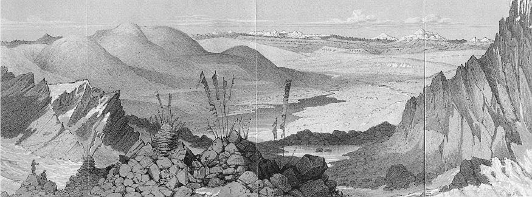

# transition state lake

In analogy to a "data lake," a bunch of transition-state structures that I've found over the years.

These may be useful for various applications—benchmarking, studying reaction dynamics, and so on and so forth.

## Provenance
Where did these come from?
 - `xyzs/Misc/glu_gluC6-BCDR-Na2_1Me2O-bisCF3-ts-mpw3pbe-631gd-pcm_thf.xyz` comes from [this JACS paper](https://pubs.acs.org/doi/full/10.1021/jacs.9b07022)
 - Several other structures in `xyzs/Misc` come from [this JACS paper](https://pubs.acs.org/doi/abs/10.1021/jacs.2c06688), as do the structures in `xyzs/Prins`.
 - The structures in `xyzs/polycyclization` correspond to [this JACS paper](https://pubs.acs.org/doi/abs/10.1021/ja101256v?&) although these unpublished calculations were done by me, almost a decade after the paper was published.
 - The structures in `xyzs/Glycosylation` come from [this Nature paper](https://www.nature.com/articles/s41586-022-04958-w).
 - The structures in `xyzs/Pictet-Spengler` come from unpublished calculations I did in support of [this Nature paper](https://www.nature.com/articles/s41586-022-05263-2).
 - The structures in `xyzs/OCF3` and `xyzs/OxAdd`come from unpublished work I did in the Buchwald Group at MIT.
 - The (pre-TS-opt) structures in `xyzs/noyori-literature` are generated from literature data by [@nhadler](https://github.com/nhadler).

If this is used as a collective dataset, no itemized citation of the underlying work is necessary—these citations are simply provided for completeness.

*Corin Wagen*
